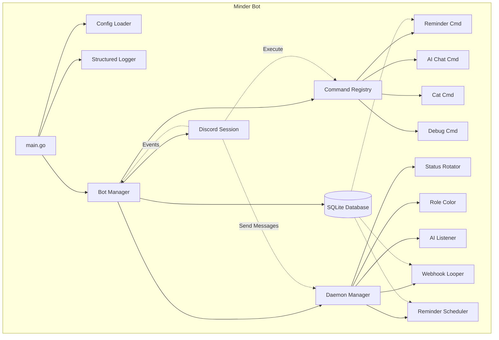

# Minder

[](https://go.dev/)
[](LICENSE)
[](https://goreportcard.com/report/github.com/leeineian/minder)

A high-performance Discord bot written in **Go** with **discordgo**, featuring slash commands, background daemons, and a powerful webhook stress testing system.

## ✨ Features

- **⏰ Reminders**: Schedule reminders with natural language time parsing
- **🤖 AI Chat**: Talk to AI (basic implementation)
- **😺 Cat Commands**: Make the bot say things
- **🔧 Debug Tools**: Admin utilities including webhook stress testing
- **🌈 Status Rotator**: Auto-rotating bot status
- **🎨 Role Color Rotator**: Automatically change role colors

### 🔥 **Webhook Looper** (High-Performance)
The crown jewel of this rewrite - a Goroutine-based webhook stress testing tool that can handle thousands of concurrent loops without blocking.

## 🏗️ Architecture



## 🚀 Tech Stack

- **Language**: Go 1.23+
- **Discord Library**: `discordgo`
- **Database**: SQLite (`modernc.org/sqlite` - pure Go)
- **Logging**: `log/slog` (structured logging)
- **Testing**: Go's built-in testing framework

## 📦 Setup

### Prerequisites
- Go 1.21 or higher
- Discord bot token ([Get one here](https://discord.com/developers/applications))

### Installation

1. **Clone the repository**
```bash
git clone https://github.com/leeineian/minder.git
cd minder
```

2. **Configure environment**
```bash
cp .env.example .env
# Edit .env with your Discord bot token and configuration
```

3. **Build the bot**
```bash
make build
# or
go build -o bin/minder cmd/minder/main.go
```

4. **Run the bot**
```bash
./bin/minder
# or
make run
```

## 🎮 Commands

| Command | Description |
|---------|-------------|
| `/reminder set <message> <when>` | Set a reminder |
| `/reminder list` | List your reminders |
| `/cat say <message>` | Make the bot say something |
| `/ai chat <message>` | Talk to AI |
| `/debug webhook-looper ...` | Webhook stress testing (Admin only) |

## 🛠️ Development

### Running Tests
```bash
# Run all tests
make test

# Run tests with coverage
make test-coverage

# View coverage report
open coverage.html
```

### Linting & Formatting
```bash
# Run all linters
make lint

# Format code
make fmt

# Check formatting
make fmt-check
```

### Docker

```bash
# Build Docker image
make docker-build

# Run with docker-compose
make docker-run

# Stop containers
docker-compose down
```

## 📁 Project Structure

```
minder/
├── cmd/
│   └── minder/          # Application entry point
├── internal/
│   ├── bot/            # Discord bot core logic
│   ├── commands/       # Slash command implementations
│   │   ├── ai/         # AI chat commands
│   │   ├── cat/        # Cat commands
│   │   ├── debug/      # Debug commands
│   │   └── reminder/   # Reminder commands
│   ├── config/         # Configuration management
│   ├── daemons/        # Background services
│   │   ├── aichat/     # AI chat listener
│   │   ├── looper/     # Webhook looper
│   │   ├── rolecolor/  # Role color rotator
│   │   ├── scheduler/  # Reminder scheduler
│   │   └── status/     # Status rotator
│   ├── database/       # Database operations
│   └── logger/         # Structured logging
├── .github/
│   └── workflows/      # CI/CD pipelines
├── Dockerfile          # Multi-stage Go build
├── docker-compose.yml  # Container orchestration
└── Makefile           # Build automation
```

## 🔧 Configuration

Key environment variables (see `.env.example` for full list):

| Variable | Required | Description |
|----------|----------|-------------|
| `DISCORD_TOKEN` | ✅ | Your Discord bot token |
| `CLIENT_ID` | ✅ | Discord application ID |
| `GUILD_ID` | ❌ | Guild ID for instant command registration |
| `DATABASE_PATH` | ❌ | Path to SQLite database (default: `./data.db`) |
| `LOG_LEVEL` | ❌ | Logging level: `debug`, `info`, `warn`, `error` (default: `info`) |
| `ENVIRONMENT` | ❌ | `production` for JSON logs, `development` for text (default: `development`) |

## 🧪 Testing

The project includes comprehensive unit tests:
- **Config loading** and validation
- **Database operations** with concurrency
- **Logger initialization** and output
- **Command registration** system

Current coverage: **~60%** of core packages

## 🤝 Contributing

Contributions are welcome! Please read [CONTRIBUTING.md](CONTRIBUTING.md) for details on our code of conduct and development process.

1. Fork the repository
2. Create your feature branch (`git checkout -b feature/amazing-feature`)
3. Commit your changes (`git commit -m 'Add amazing feature'`)
4. Push to the branch (`git push origin feature/amazing-feature`)
5. Open a Pull Request

## 📝 License

This project is licensed under the GNU General Public License v3.0 - see the [LICENSE](LICENSE) file for details.

## 🔗 Links

- [Report Bug](https://github.com/leeineian/minder/issues/new?labels=bug)
- [Request Feature](https://github.com/leeineian/minder/issues/new?labels=enhancement)
- [View Changelog](CHANGELOG.md)

## 🙏 Acknowledgments

- Built with [discordgo](https://github.com/bwmarrin/discordgo)
- Powered by [modernc.org/sqlite](https://gitlab.com/cznic/sqlite)
- Inspired by modern Go best practices

---

Made with ❤️ and Go
